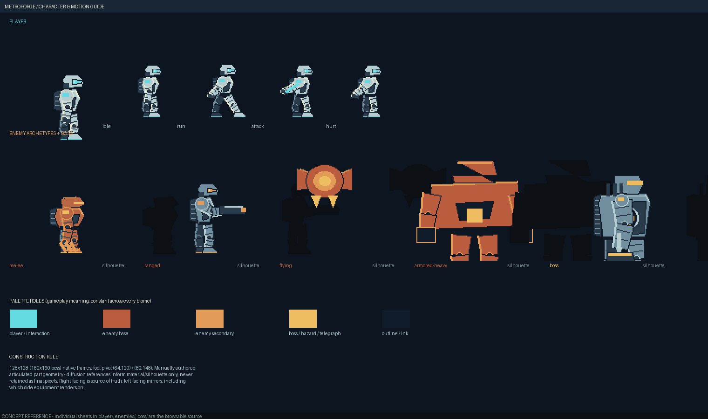
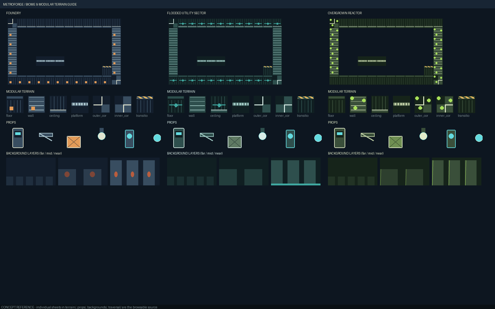

# Visual reference library — index

Concept/reference art for MetroForge's industrial sci-fi Metroidvania visual style. See
[`../VISUAL_STYLE_GUIDE.md`](../VISUAL_STYLE_GUIDE.md) for the written rules this library
illustrates, [`visual-constitution.json`](visual-constitution.json) for the machine-readable
version, [`templates/`](templates/) for the structured per-asset-role templates, and
[`PROVENANCE.md`](PROVENANCE.md) for review status. Rebuild everything with
`.venv-diffusers-mps/bin/python artifacts/visual-reference-library-20260907/build_reference_library.py`
(from the repo root).

## Start here

| | |
|---|---|
|  | **[Character & Motion Guide](style-sheets/character-motion-guide.png)** — player poses, all 4 enemy archetypes + boss with silhouettes, gameplay palette roles, construction rule. |
|  | **[Biome & Terrain Guide](style-sheets/biome-terrain-guide.png)** — all three biomes' connected-room sample, modular tile kit, props, and background layers side by side. |

## Player — [`player/`](player/)

- [`player-pose-guide.png`](player/player-pose-guide.png) — idle / run / jump* / fall* / attack / hurt / death (*synthesized concept poses, see PROVENANCE.md).
- [`player-construction-guide.png`](player/player-construction-guide.png) — labeled body-part construction.
- [`player-silhouette.png`](player/player-silhouette.png), [`player-palette.png`](player/player-palette.png).

## Enemies — [`enemies/`](enemies/)

- [`enemy-lineup.png`](enemies/enemy-lineup.png) — melee / ranged / flying / armored-heavy scale + silhouette comparison.
- [`melee-archetype.png`](enemies/melee-archetype.png), [`ranged-archetype.png`](enemies/ranged-archetype.png), [`flying-archetype.png`](enemies/flying-archetype.png), [`armored-heavy-archetype.png`](enemies/armored-heavy-archetype.png) — each with reference / silhouette / attack-anticipation pose.

## Boss — [`boss/`](boss/)

- [`boss-reference.png`](boss/boss-reference.png) — scale vs. player, weak-point callout, attack anticipation/contact/recovery, death progression.

## Terrain — [`terrain/`](terrain/) (per biome: `foundry`, `flooded_utility`, `overgrown_reactor`)

- `<biome>-tile-kit.png` — floor / wall / ceiling / platform / outer-corner / inner-corner / transition.
- `<biome>-connected-room.png` — a representative small room composed from that kit.

## Traversal — [`traversal/`](traversal/)

- `<biome>-traversal.png` — door / lift / breakable barrier / one-way platform / an ability gate sample.
- [`ability-gate-color-code.png`](traversal/ability-gate-color-code.png) — the full, biome-neutral ability→color mapping.

## Props & gameplay objects — [`props/`](props/)

- `<biome>-props.png` — machinery / pipe / crate / light / checkpoint / pickup / hazard / projectile / exit marker.

## Backgrounds — [`backgrounds/`](backgrounds/)

- `<biome>-far.png` / `-mid.png` / `-near.png` / `-composite.png` (composite includes a foreground contrast block).

## Templates — [`templates/`](templates/)

Structured `VisualReferenceTemplate` / `BiomeVisualTemplate` JSON instances and reusable prompt
recipes — see [`templates/README.md`](templates/README.md).
