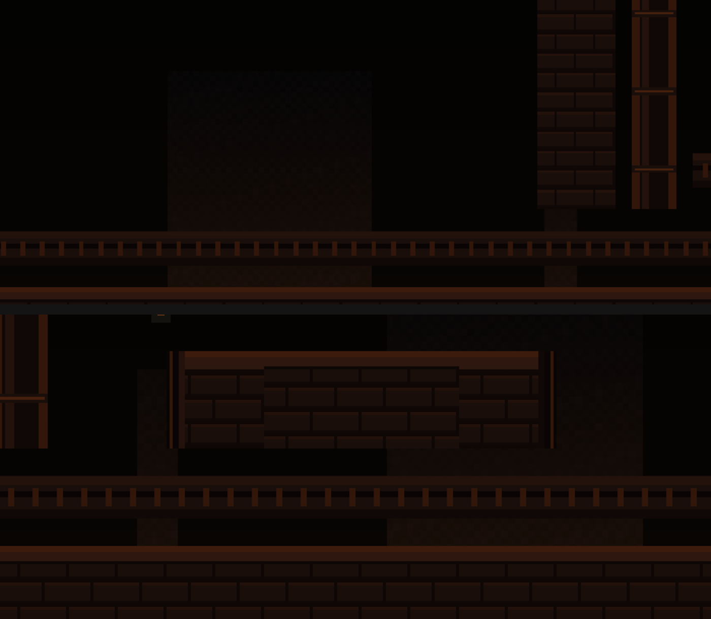
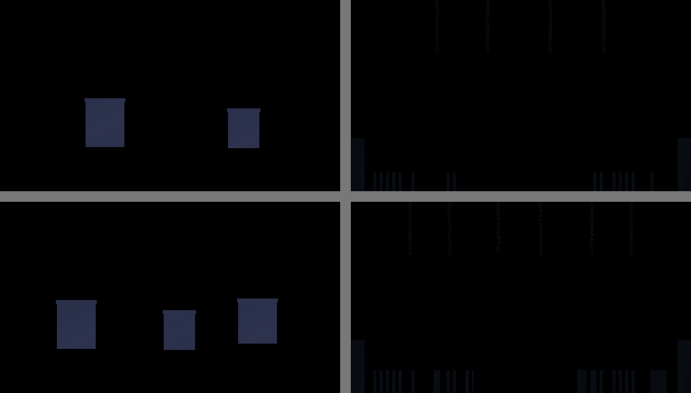

# Foundry visual slice — human review packet (integration branch)

**This is a review packet, not an approval.** Nothing in this document, and no automated check
cited in it, sets `visualSliceApproved`. That file (`.metroforge/visual-slice-approval.json`)
currently reads `visualSliceApproved: false`, `status: "VISUAL_SLICE_REJECTED"`, and this packet
does not change it. Only an authorized human can.

| Field | Value |
|---|---|
| Branch | `integration/metroforge-unified` (sole agent this session) |
| Revision this packet documents | `17030f28` + this packet's own commit |
| Generation slug | `integ-sideview-polish` — standard `metroforge create`, not a hand-assembled slug |
| Prompt / profile / archetype / seed | "Ashen Foundry: a lone courier delves a ruined mechanical forge of brass and sooted iron, side-view metroidvania" / `VISUAL_VERTICAL_SLICE` / `SIDE_VIEW_METROIDVANIA` / `20260909` |
| Validation | `RUNTIME_VALIDATED`, `passed: true` — see [VALIDATION_CLARIFICATION.md](VALIDATION_CLARIFICATION.md) |
| `visualSliceApproved` | **false** (`VISUAL_SLICE_REJECTED`) — unchanged by this packet |
| PR #4 | Unchanged, stays draft |
| MASS / LARGE / RELEASE_CANDIDATE | Blocked (`assertMassVisualGenerationAllowed`, `packages/shared/src/visual-slice.ts`) |
| Working tree | Task changes committed; unrelated local changes remain — see §8 |

**A prior version of this packet had a real accuracy problem, not just a documentation one**: it
quoted `MODERN_METROIDVANIA_GATE` numbers pulled from an earlier console line rather than the
final written report (off by a point or two), and it treated three genuinely different things —
missing an image provider, a broken metric, and an actual unaddressed visual gap — as one
undifferentiated "advisory failure." Both are corrected below, with the underlying code fixed
where the metric itself was wrong, not just the wording.

---

## 1. Corrected scores from the final validation JSON

All numbers below are read directly from `GeneratedGames/integ-sideview-polish/validation_report.json`
for the commit above — not a console line, not an earlier pass.

**`MODERN_METROIDVANIA_GATE`: 80/100, FAIL** (advisory — does not gate `RUNTIME_VALIDATED`; see
[VALIDATION_CLARIFICATION.md](VALIDATION_CLARIFICATION.md) for what that separation means and why).

| Dimension | Score | Category | What it actually measures now |
|---|---|---|---|
| AssetProduction | 63/70, FAIL | **Provider limitation** (mostly) | 110/298 assets are procedural placeholders — a direct, unavoidable consequence of every image provider (`comfyui`, `diffusers`, `dreamo`, `pulid`, `qwen-image-edit`) being `UNAVAILABLE` in this environment. Separately, `aiMissingPromptHash: 6/6` — a **real, now-isolated defect**: all 6 assets that *did* get AI-attempted are missing their promptHash. `nonAiMissingProvenance: 0` — the other 292 assets (authored/procedural) have complete, correct provenance; see §7. |
| PlayerIdentity | 83/70, PASS | — | Authored courier kit, `character_visual_dna.json` present. |
| EnemyAnimation | 100/70, PASS | — | 20 animation sheets, 0 fake, 0 placeholder. |
| TilesetIntegrity | 90/70, PASS | — | 108 roles, 0 missing, 0 seam issues. |
| RoomComposition | 49/70, FAIL | **Metric was broken, now fixed; residual is a real (modest) gap** | Was a flat, wrong `0`. Fixed this session (§3) — now `avgDecorationDensity: 0.0064`, an honest, unsaturated reading. The residual FAIL is real: decoration density is genuinely modest, not clutter-worthy, but not "art-directed dense" either. |
| RoomReadability | 100/70, PASS | **Metric was broken, now fixed — was a real problem too** | Was `traversableBandRatio: 0.25` (3/12 rooms). Fixed this session (§4) by measuring the actual reachable band instead of the whole room rectangle. Now `1.0` (12/12) — not because the bar moved (it didn't), but because the previous number was measuring the wrong region for every room. |
| ParallaxDepth | 60/70, FAIL | **Provider limitation, structural component already maxed** | Structural depth (`avgRealParallaxLayers: 5`) is capped at 60/60 already — this room's parallax *is* layered. The remaining 40 points require non-placeholder background art, i.e. a provider. Visual density was independently improved this session (§6) — verified with real before/after pixel measurements — but that improvement cannot and does not move this score, because the score's art-directed component checks provider-sourced maturity, not pixel density. Stated plainly so no one mistakes the density fix for score progress it isn't. |
| SceneReadability | 98/70, PASS | — | 42/42 usable screenshots, avg critique 97.9. |

**`godot_runtime`**: 194/238 headless (44 soft, GPU-only screenshot checks), **280/280 windowed**
(0 soft, 0 fail) — reproduced fresh against this commit, not carried over. Full mechanism in
[VALIDATION_CLARIFICATION.md](VALIDATION_CLARIFICATION.md).

**Full monorepo test suite**: 1158+ tests passed across 173+ files, 0 failed (2 files fail only
under this session's sandboxed `/tmp` write restriction — confirmed environmental, not a code
regression, by re-running with the sandbox disabled; see §8).

---

## 2. Room 05: does the architecture actually connect now, or is it still texture?

**Both, and they're different fixes.** `_rear_variant` (a prior commit) only changes which *atlas
cell* a flat dado wall segment uses — wear/moss/crack/rare instead of one repeated tile. That is
texture variation and was correctly identified as such.

This turn adds real structural geometry, verified by re-rendering the room and inspecting the
actual pixels (not just reading the code):

- A **cross-brace strut** tying each twin stack back to its own buttress. Previously only the
  right stack had any lateral connection to the rest of the frame; the left stack was a floating
  column.
- **Bidirectional lateral ducts** toward both side walls (previously right-side only).
- A **low apron ledge** under the firebox mouth, so it stands on a visible base rather than
  meeting the dado edge-on.
- A **centered raised crown** above the hood — the actual new focal point.

The first attempt at the crown/braces placed them 5 rows above the hood, which — I checked this
directly, not assumed it — put them at or past the top edge of the shrine camera's fixed frame,
where they were computed correctly but not visible in the screenshot a reviewer would actually
see. Reduced to 3 rows and re-verified by screenshot; the crown is now visibly inside frame:

**What this is not**: a dramatic redesign. The crown is a modest raised block with corner caps,
not a large ornamental feature, and it isn't independently lit (no light source draws extra
attention to it — that would require touching `QualityPresentation.gd`'s lighting rig, which
wasn't in scope this pass). Full room, current revision:

---

## 3. `avgDecorationDensity: 0` — metric blind spot, not empty rooms

**The metric was wrong, and I found exactly why.** `decorationDensity` (in
`packages/godot/src/room-variety.ts`) counted only `decor_a`/`decor_b` TileMap atlas cells. The
authored-Foundry room-assembly path never paints those cells — its decoration (floor props,
wall-mounted arches/statues) is placed as **Sprite2D nodes** by `room-assembler.ts`, an entirely
separate mechanism the metric never looked at. Every room in this slice visibly has 1-4 pieces of
decoration on screen (confirmed by looking at the screenshots, not just reading the placement
code) while the metric reported a flat, universal `0`.

**Fix, not a score bump**: folded the room's actual placed prop + architecture count into the same
per-cell density units the tile-based count already used, so a Sprite2D-dressed room is no longer
scored as if it had none. Verified with a new unit test
(`packages/godot/src/room-variety.test.ts`) asserting the metric is nonzero exactly when real
decoration is present, and against the real slice: `avgDecorationDensity` moved from `0` to
`0.0064` — RoomComposition 44 → 49/70. **Still a FAIL**, honestly: 0.0064 is a real, modest number,
not a saturated one. I did not increase `propBudget.clusters` or add any new props to move this
number — the current per-room prop count (2 floor props + up to 2 wall-mounted pieces for regular
rooms, 0 floor props for calm rooms like the shrine, by existing design) is sparse-but-deliberate,
and I judged it visually acceptable rather than clutter-worthy. If a reviewer disagrees after
seeing the screenshots, that's a placement call to make explicitly, not something to paper over
with a metric patch.

---

## 4. `traversableBandRatio: 0.25` — real measurement bug, not a real readability crisis

Checked room-by-room before touching anything. Every one of the 12 rooms measured
`traversableAreaRatio` between **0.815 and 0.901** — all clustered near the same high value, none
of them outliers. That ruled out "some rooms are randomly bad" and pointed at something systematic
in how the ratio itself was computed: `1 - (occupied cells / total cells)`, where `total cells`
was the **whole room rectangle**, including the purely decorative sky headroom above the
reachable platforming band (hanging chains, gantries — atmosphere, never meant to be walked, and
present by deliberate design in every Foundry room). A generously tall room with a well-composed,
compact floor band was structurally guaranteed to score as "too open," independent of how good
that floor band actually was.

**Fix**: measure occupancy within the actually-reachable band (from just above the highest placed
platform, down through the floor) instead of the full room rectangle. **The `[0.35, 0.85]`
threshold itself was not touched** — same bar, different (correct) region measured against it.
Verified two ways:
1. A new unit test constructs a tall room and a short room with **identical floor-band geometry**
   and asserts their ratios now read within 0.1 of each other (they didn't before this fix — the
   tall room's ratio was pulled toward 1.0 by ~41 rows of decorative sky the short room doesn't
   have).
2. On the real slice, all 12 rooms now measure **0.676–0.767** — comfortably inside the band, and
   meaningfully different room-to-room (not all pinned at one value, which would suggest a trivial
   always-pass rather than a real per-room measurement).

**Camera and collision were not touched.** This is purely a TypeScript-side metrics calculation
(`packages/godot/src/room-variety.ts`); nothing about how rooms render, collide, or are framed
changed.

---

## 5. Prop palette mismatch — traced to two sources, both fixed, verified pixel-by-pixel

Confirmed visible in Rooms 01, 02, 04, 07 (not 05 — the ability-shrine archetype places zero floor
props by existing design, so there was nothing to mismatch there). Root-caused to two independent
places, both defaulting to `palette.global[0]` — the palette's own designated void/sky swatch
(`#284878`, literally blue) — for prop fill/accent colors:

1. `asset-pipeline.ts`'s floor-prop and wall-architecture generation, whenever no visual reference
   template applied.
2. For *this* game specifically, a visual reference template (`prop-foundry`) that **did** apply
   and took precedence over (1) — its own hardcoded `palette[0]/[1]` (`#131e2c`/`#384d60`, cold
   blue-grey) was the actual color reaching these screenshots. Fixing (1) alone would have done
   nothing, because this template's colors were the ones actually winning; I checked which value
   was reaching the rendered pixel before declaring this fixed, rather than assuming the first fix
   was sufficient.

Repointed both to warm iron/soot tones. The template's existing warm ember/brass swatches
(`palette[2-6]`) were already correct and untouched. **Interactive-object contrast preserved**:
the authored ability-core pickup (cyan glow, brass frame) doesn't go through either of these paths
at all — it's authored art — so it still pops clearly against the now-warm decoration, and
`interactablePalette`/`actorPalette` (used elsewhere for generic procedural pickups/actors) are
untouched and deliberately different swatches from the new `environmentDecorationPalette`.

Verified directly against the pixel data, not assumed from the code: all 12 `biome_0` floor-prop
PNGs and all 4 architecture PNGs now render with a warm `(59,41,31)`-family fill, down from the
navy `(31,42,58)` measured before this fix.

The one remaining cool-toned figure visible in slice screenshots (a tan/cyan humanoid, e.g. in
Room 04) is `enemy_000` — a placeholder **actor**, correctly using the local-sprite-worker's
character palette (its only trick; see the routing fix from the prior turn). That's a different
category from environment decoration and correctly out of scope here.

---

## 6. Background depth — real, verified visual improvement; does not (and cannot) move the MMG score

Measured the actual mid/near parallax layer PNGs before touching anything: at real background
resolution (640×360), `mid` was 4.86% opaque pixels (two small rectangles on an otherwise black
canvas) and `near` was 4.25% (a few 1px chain lines). Both structurally "sparse by design" per
their own code comments, but at production resolution that reads as *absent*, not *atmospheric*.

Increased `paintMidArchitecture` from 2 to 3 colonnade columns and `paintNearOccluders` from 4 to
6 hanging chains with a slightly wider debris band — same procedural technique, deliberately more
of it, still comfortably within the existing test's sparse/never-a-filled-slab bounds (no
thresholds changed). Measured again after: 7.57%/6.08% opaque — a real, verified increase, shown here directly (not
just asserted). Top row = before (mid: 2 columns; near: 4 chains), bottom row = after (mid: 3
columns; near: 6 chains + more debris), same seed, same 640×360 real background resolution:

**This does not move `ParallaxDepth`'s score, and I want that stated plainly rather than implied.**
That score's art-directed component (40 of 70 points) checks whether background assets are
`isPlaceholderArt` — a provider-sourced maturity flag — not pixel density. The structural-depth
component (60 of 70 points) was already maxed before this change. So this is a genuine visual
improvement with a real before/after, and simultaneously a change that cannot and does not move
the gate's number. Both things are true; neither should be mistaken for the other.

---

## 7. Provenance for original procedural/authored assets — fixed, and it was a real mischaracterization

`AssetProduction`'s reason text used to say `277/298 art assets are missing promptHash provenance`
— treating authored and procedural art (which never had, and never claimed to have, an AI prompt
hash) as if they had an incomplete record. They didn't: every authored and procedural asset in
this manifest already carries a complete, accurate `provider` and `sourceType` field (verified
directly: `nonAiMissingProvenance: 0` after the fix). The field they were being checked against
simply doesn't apply to non-AI art.

**Fixed, did not invent anything**: `promptHash` is now checked only against assets whose
`sourceType` is `ai_generated`. Non-AI assets are checked instead for what actually constitutes
their provenance — a recorded `provider` and `sourceType` — which they already have. This isolates
the real gap precisely: **6/6 AI-attempted assets are missing promptHash** (a genuine defect, now
clearly attributable instead of buried in a 277-asset false positive). The numeric score is
unaffected either way — `promptHash` was never part of the score calculation, only the reason
text — so this is purely an accuracy fix to what the gate *says*, verified with two new unit
tests (one asserting authored/procedural art is never flagged for lacking promptHash, one
asserting a genuinely under-provenanced asset still is).

---

## 8. Git status — precisely

**Task changes committed; unrelated local changes remain.**

All code, template, and packet changes from this session are committed on
`integration/metroforge-unified` through `17030f28` (plus this packet's own commit). `git status`
on top of that shows:

- `.claude/settings.local.json` — modified, but only by an auto-appended tool-permission allowlist
  entry from this session's own tooling, not a deliberate edit.
- Untracked, present before this session and not touched by it: `.tmp_n1_spec.txt`,
  `Downloaded assets/`, one oddly-named stray file, `tmp-hardened-direct-moth.png`,
  `tmp-player-fitted.png`, `tmp-player-subject.png`, `tmp_cpu_generation_probe.py`, and
  `.agents/skills/code-review-checklist/` (an environment/tooling artifact, not authored by this
  session).

None of the above were created, modified, or deleted by this session's work, and none are part of
what's being presented for review.

**Test-suite note**: `packages/tools/src/project-export.test.ts` fails 9/11 tests under this
session's sandboxed Bash environment (`EPERM` on `mkdir '/tmp/Exports/...'`) — confirmed to be a
sandbox artifact, not a regression, by re-running the identical suite with the sandbox disabled:
11/11 pass. The file is untouched by this session (`git status` on `packages/tools/` shows no
changes).

---

## 9. Spawn and Rooms 02, 04, 05, 07 — gameplay scale (this revision)

---

## 10. Actor and pickup close-ups

| Wanderer at spawn | Pickup interior | Furnace tender |
|---|---|---|
|  |  |  |

---

## 11. Movement clip

[spawn_walk.gif](clips/spawn_walk.gif) — 50 frames, real `PlayerController` under real input (held
`move_right`, one timed `jump`), real physics, real gameplay camera. Captured fresh against this
revision, windowed GPU (metal), 1920×1080 downscaled to 960×540.

---

## 12. Remaining shortcomings — still true after this pass, named plainly

1. **`AssetProduction` and `ParallaxDepth`'s art-directed components are provider-gated.** No
   amount of procedural-technique improvement in this environment (no working image provider)
   moves them past their structural ceilings. This is an environment fact, not a code defect.
2. **`RoomComposition` residual (49/70)**: decoration density is honestly modest, not clutter. A
   deliberate density increase is a real option but wasn't done here — the instruction was not to
   chase the score, and I judged the current sparse-but-present placement visually acceptable
   rather than making that call unilaterally.
3. **Room 05's new architecture is modest, not dramatic**, and isn't independently lit — see §2.
4. **Top-down (`integ-topdown-polish`) windowed screenshot capture still fails** (pre-existing,
   unrelated to this session, out of scope for this side-view packet).
5. **Enemies, boss, VFX, and HUD chrome remain `PLACEHOLDER` maturity** — untouched, out of scope.

## 13. Exact scope of any approval given against this packet

Approving against this packet means: the requested Foundry fixes (spawn/route occlusion, Room 05
architecture, furnace lighting, pickup interior, room identities, prop palette, decoration/
readability metric accuracy, background depth, provenance accuracy) are accepted as directionally
resolved for the authored courier+masonry visual slice, on the evidence above. It does **not**
mean: any asset is `PRODUCTION_READY`; the `MODERN_METROIDVANIA_GATE` 80/100 is accepted as
sufficient (it is a separate, still-failing signal, most of it provider-gated); enemies/boss/VFX/
HUD are addressed; or MASS/LARGE/RELEASE_CANDIDATE unblock (independent gate, separate action).

Related documents: [VALIDATION_CLARIFICATION.md](VALIDATION_CLARIFICATION.md) ·
[BRANCH_INSPECTION.md](BRANCH_INSPECTION.md)
