# Foundry visual slice — human review packet (integration branch)

**This is a review packet, not an approval.** Nothing in this document, and no automated check
cited in it, sets `visualSliceApproved`. That file (`.metroforge/visual-slice-approval.json`)
currently reads `visualSliceApproved: false`, `status: "VISUAL_SLICE_REJECTED"`, and this packet
does not change it. Only an authorized human can.

| Field | Value |
|---|---|
| Branch | `integration/metroforge-unified` (sole agent this session) |
| Revision this packet documents | commit `656bede6` + this packet's own commit |
| Generation slug | `integ-sideview-polish` — standard `metroforge create`, not a hand-assembled slug |
| Prompt / profile / archetype / seed | "Ashen Foundry: a lone courier delves a ruined mechanical forge of brass and sooted iron, side-view metroidvania" / `VISUAL_VERTICAL_SLICE` / `SIDE_VIEW_METROIDVANIA` / `20260909` |
| Validation | `RUNTIME_VALIDATED`, `passed: true` — see [VALIDATION_CLARIFICATION.md](VALIDATION_CLARIFICATION.md) for exactly what that does and doesn't mean |
| `visualSliceApproved` | **false** (`VISUAL_SLICE_REJECTED`) — unchanged by this packet |
| PR #4 | Unchanged, stays draft |
| MASS / LARGE / RELEASE_CANDIDATE | Blocked (`assertMassVisualGenerationAllowed`, `packages/shared/src/visual-slice.ts`) |

---

## 0. Effective asset sources — what actually reaches this generated game

A prior report said `metroforge-foundry-v3` (an external prebuilt pack) auto-activates for the
side-view visual slice and would supply its blue-steel tileset instead of the authored soot-brick
masonry. That was traced and fixed this session (`7abdbf2d`): `applyVisualSliceIdentityDefaults`
no longer forces a pack; the authored `authored-original` courier+masonry path is the side-view
slice default; `metroforge-foundry-v3` only applies if a caller explicitly passes
`--external-visual-pack metroforge-foundry-v3`. Both paths still work — nothing was deleted.

**Verified reproducible for this exact revision** (`generation_manifest.json`, 317 artifacts):

| Provider | Count | What |
|---|---|---|
| `authored-original` | 154 | Player/NPC actor kit + all 3 biome tilesets (`packages/assets/authored/foundry-courier/`, `foundry-masonry/`) |
| `procedural` | 113 | Environment props, parallax backgrounds, architecture — up from 67 before this session's routing fix (see §2) |
| `pixel-art-processor` | 40 | Derived pose/animation sheets compiled from the authored stills |
| `local-sprite-worker` | 5 | Enemy base sprites only — down from 51 before the routing fix; this worker now only answers CHARACTER/ENEMY/BOSS/NPC requests |
| `nvidia-image` | 5 | Attempted where a live NVIDIA key was configured; everything else in this environment reports every diffusion provider (`comfyui`, `diffusers`, `dreamo`, `pulid`, `qwen-image-edit`) `UNAVAILABLE` |

The tileset `source.png` byte-for-byte matches `packages/assets/authored/foundry-masonry/source.png`
in this repo — checked directly, not inferred from provider labels.

---

## 1. Spawn and Rooms 02, 04, 05, 07 — gameplay scale (fresh capture, this revision)

### Spawn (room_000, tutorial)
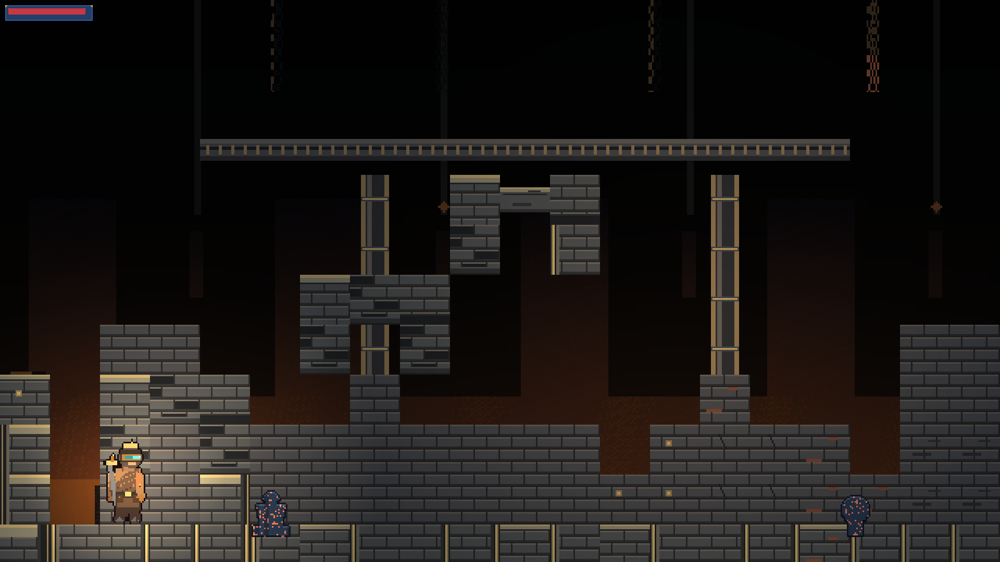

### Room 02 — traversal (colonnade identity)
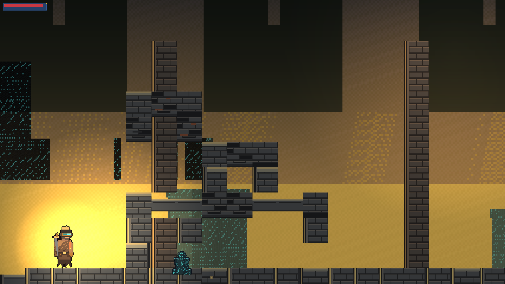

### Room 04 — vertical shaft (traversal identity)
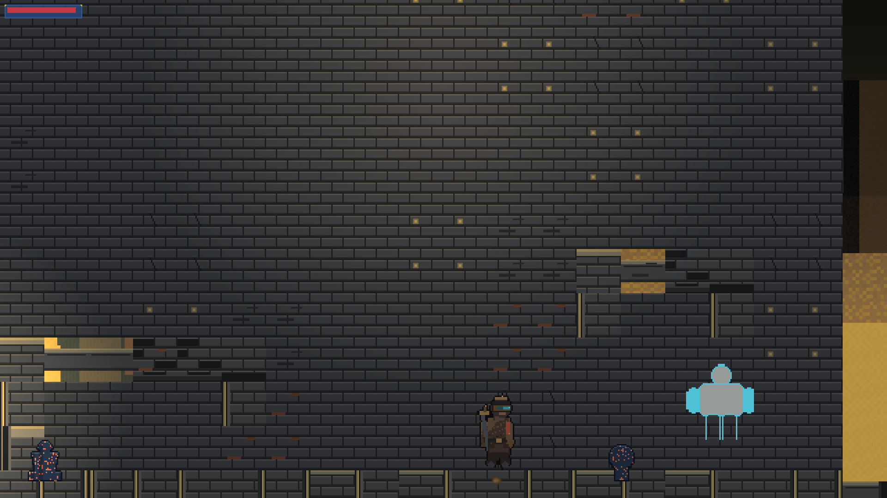

### Room 05 — ability shrine (furnace hearth identity)
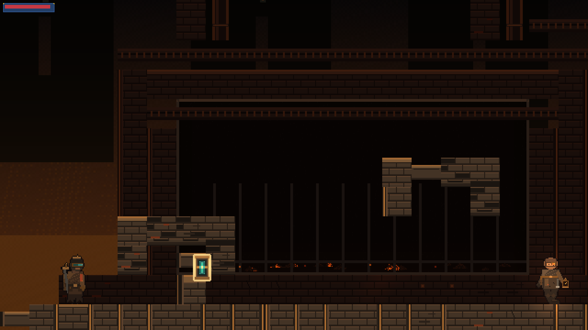

### Room 07 — checkpoint (gallery-wall identity)
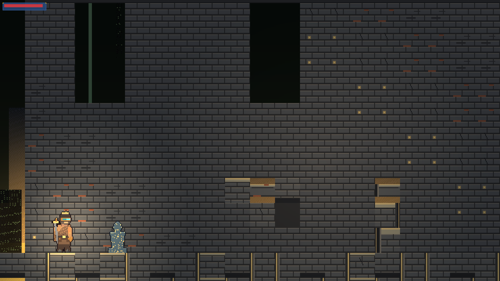

All five are visually distinct rooms, not the same wall with a different actor standing in front
of it — colonnade piers + teal moss patches (02), a dark vertical shaft with a ladder track (04),
a built furnace apparatus with a recessed dark cavity (05), a solid gallery wall with a high slit
row (07), each with its own `rear.modulate` tint (`QualityPresentation.gd`).

---

## 2. Before / after — the five requested fixes

### Fix 1 — no tiles or props obscuring the Wanderer at spawn
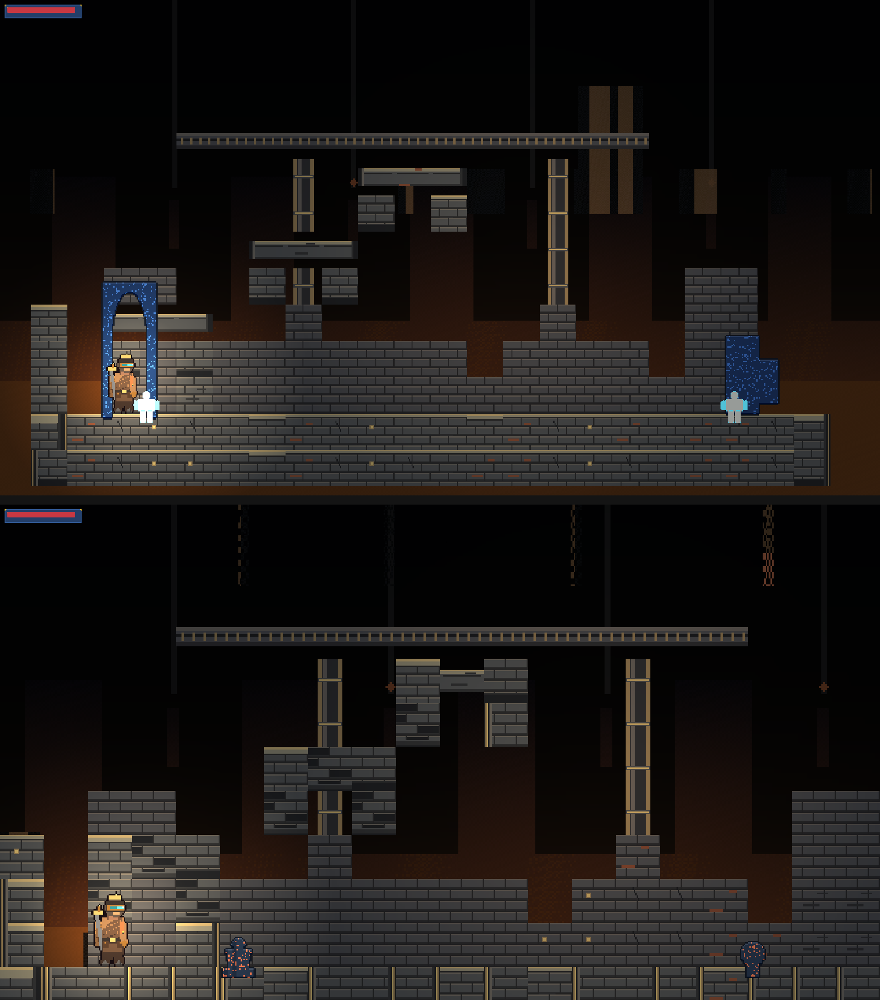
*Top: before (stale `metroforge-foundry-v3` pack + a diffusion-worker prop bug). Bottom: this
revision.*

The Wanderer was never occluded by **tiles** in either version (`Ground z_index=1`, actor
`z_index=10`, fixed in an earlier session). What *was* wrong, found by inspecting these exact
screenshots this session: the environment-prop generator's last-resort fallback — a local
Pillow-based worker built to draw humanoid **character** sheets — was being handed prop/
background/icon requests too (every real diffusion provider is `UNAVAILABLE` here), and it has
only one trick: a pale tan-and-cyan humanoid. That is the second, unexplained "figure" that used
to stand shoulder-to-shoulder with the courier at spawn. Two independent fixes, both committed and
tested:

- `a4497d38` — the worker adapter now refuses any request that isn't `CHARACTER`/`ENEMY`/`BOSS`/
  `NPC`, so props fall back to the purpose-built procedural prop renderer instead.
- `656bede6` — the default decoration-zone placement (`compose-visuals.ts`) put props in the outer
  5–23% / 77–95% of every room, which overlaps the player's actual spawn footprint (`SPAWN_MARGIN`
  = 80px from either edge, `WorldManager.gd`); zones are now inboard at 16–32% / 68–84%, with a
  132px clamp in `room-assembler.ts` as a backstop.

The remaining prop in the "after" frame is a dark, speckled shrine/pews silhouette, clearly
scenery, standing a full body-width-plus clear of the Wanderer — not a glowing look-alike figure
inches from the player.

### Fix 2 — Room 05: connected architecture, less repeated square panelling
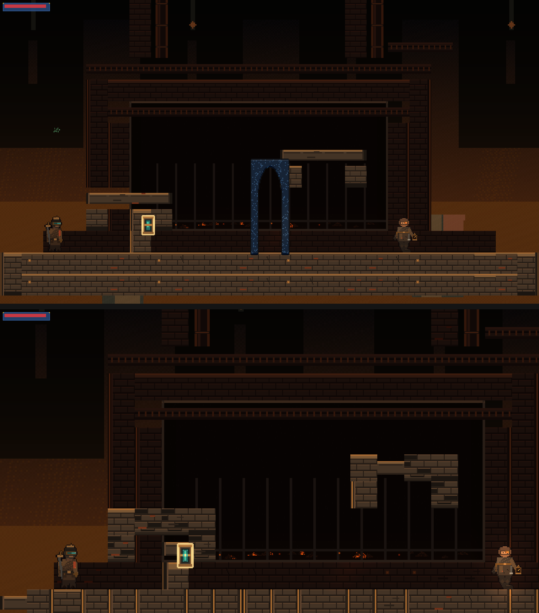

`_paint_furnace_hearth` already built jambs/hood/twin-stacks/lateral-duct before this session; the
remaining flatness was the large solid dado fill at floor level repeating one wall tile verbatim.
`6a23e95b` adds `_rear_variant()`: a biome-seeded, 2×2-grouped substitution across the existing
wear/moss/crack/rare atlas cells (already painted, previously unused by this fill path), kept
canonical the majority of the time so it reads as aged masonry rather than a checkerboard. The same
fix applies to every room role, not just the furnace — visible as wear/crack marks on Room 07's
solid gallery wall too:

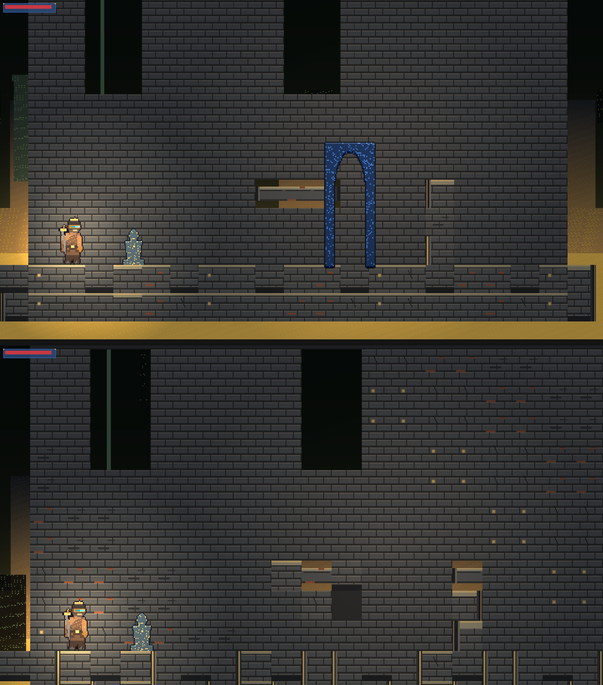

### Fix 3 — selective furnace lighting: dark cavity + separated tender

Tender close-up:
| Before | After |
|---|---|
| 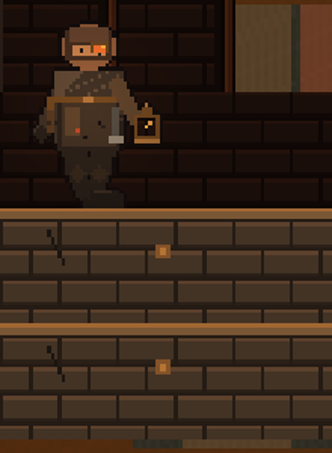 | 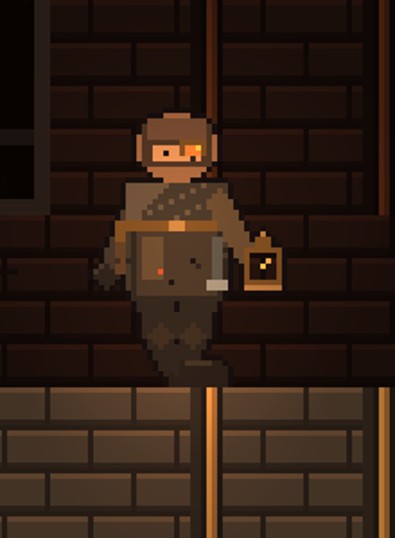 |

`cf1ecacb`: `ShrineTenderLight` energy raised 0.32→0.62 with a wider falloff, plus a new
`ShrineTenderBounce` warm light at floor height near the tender's feet. `ShrineHearthLight` and
`RearWall.light_mask = 2` are untouched, so the recessed firebox cavity is exactly as dark as
before — visible in the full Room 05 shot above (the black band behind the grate bars).

### Fix 4 — a recognizable pickup interior with the readable outline preserved
| Before | After |
|---|---|
| 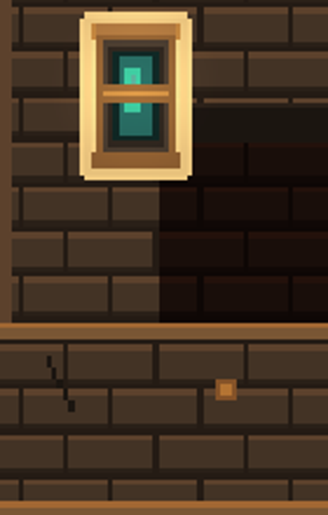 | 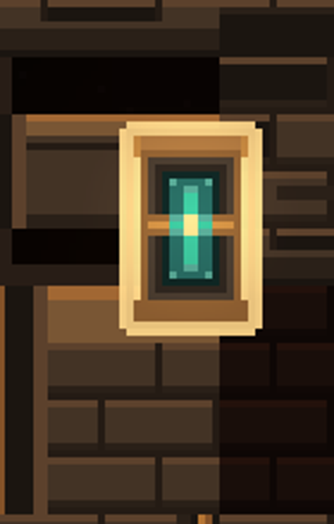 |

`5d3f5d45`: the interior was a single cyan bar that the brass mid-band cut into two disconnected
pieces. It's now a bright cross-filament (vertical filament + cross-bar + hot cream centre) with
the mid-band split around the window instead of through it, so the core reads as one contained
object. The baked-in cream rim outline (`paint_foundry_masonry.py`'s per-pixel border loop) is
byte-identical to before — never touched.

### Fix 5 — distinct room identities in Rooms 02, 04, 07
Shown in full in §1 above. Each already had a distinct `_paint_*` role function and rear-wall tint
before this session; `_rear_variant()` (fix 2) applies to all of them equally, so the wear/crack/
moss variation shows up in the checkpoint gallery wall too (visible as small dash marks in
Room 07's screenshot) without erasing any room's distinct silhouette.

---

## 3. Actor and pickup close-ups

| Wanderer at spawn | Pickup interior | Furnace tender |
|---|---|---|
| 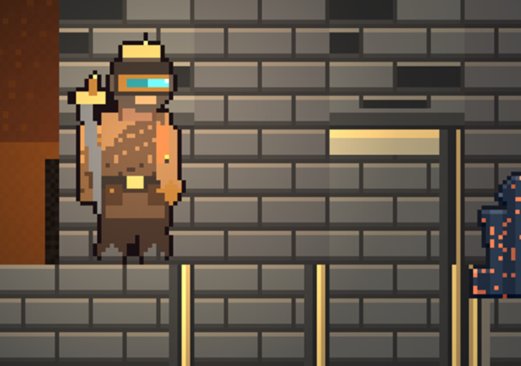 |  |  |

---

## 4. Movement clip

[spawn_walk.gif](clips/spawn_walk.gif) — 50 frames (~2.5s at 20fps-equivalent sampling, every 3rd
physics frame), captured with the real `PlayerController` under real input (held `move_right`,
one timed `jump`), real physics, and the real gameplay camera — not a teleport sequence.  Recorded
this session directly against `integ-sideview-polish`, windowed GPU (`metal`), 1920×1080 downscaled
to 960×540 for file size.

Use it to judge: the Wanderer clears both repositioned props with room to spare; walk frames are
distinct poses, not a single-frame bob; the courier stays in front of masonry throughout, never
behind or inside a tile; the camera holds the tutorial contain-frame.

---

## 5. Validation — what passed, what's soft, what's advisory

Full explanation with reproduction commands: **[VALIDATION_CLARIFICATION.md](VALIDATION_CLARIFICATION.md)**.

Short version, all freshly measured against this exact revision:

- `RUNTIME_VALIDATED`, `passed: true`, **19/20** validation-report gates non-blocking.
- `godot_runtime` (headless): **194/238** — the 44 shortfalls are **all** `gameplay_screenshot_*`
  soft checks that structurally require a real GPU framebuffer; zero hard failures.
- Same scene, windowed GPU (metal): **280/280**, 0 soft-fail, 0 fail — reproduced directly this
  session, not carried over from an earlier report.
- `gameplay_screenshot_qa`: **PASS, score 100** (248 unique colors, lumaStdDev 24.1, occupancy 0.49).
- `godot_playtest`: **8/8**, persona `victory_rusher`, full run to victory.
- `MODERN_METROIDVANIA_GATE` (advisory, does not gate `RUNTIME_VALIDATED`): **76/100, FAIL** —
  `AssetProduction 64/70`, `RoomComposition 44/70`, `RoomReadability 66/70`, `ParallaxDepth 60/70`
  all below the 70 bar; `PlayerIdentity 83`, `EnemyAnimation 100`, `TilesetIntegrity 90`,
  `SceneReadability 98` all pass. Newly wired this session (`ad965cd1`, fixed twice more:
  `131abf8c`, `1c36834f`); this is the first revision it has ever scored, so there is no prior
  number it was "weakened" from.
- Full monorepo test suite: **1158 passed, 9 skipped, 0 failed** (174 test files), run fresh
  against this revision's code.

---

## 6. Remaining visual shortcomings — named plainly, not folded into a pass/fail

These are not fixed by this revision and are not claimed to be:

1. **`AssetProduction 64/70` and the low `MODERN_METROIDVANIA_GATE` score generally** are mostly a
   direct consequence of every diffusion image provider being `UNAVAILABLE` in this environment —
   props, backgrounds, and enemy sprites fall back to procedural/placeholder art. This is an
   environment/provider-availability fact, not something this session's code changes can close.
2. **`RoomComposition 44/70`** — `avgDecorationDensity: 0` — rooms have essentially no
   environment-prop *density* even where props are correctly placed and no longer look like stray
   characters; there simply aren't many of them per room. A composition/density pass is separate
   work from this session's occlusion/lighting/identity fixes.
3. **`ParallaxDepth 60/70`** — all 15 background layers across 3 biomes are procedural strips; "the
   far layer attempts real generation" but nothing else does, for the same provider-availability
   reason as #1.
4. **Prop palette mismatch** — the procedural shrine/pews/debris props render in a cool blue
   (`palette.global[0]`) against the warm soot-and-brass Foundry palette. They no longer look like
   characters (this session's fix), but they still don't match the room's color language. Not
   addressed here.
5. **Top-down (`integ-topdown-polish`) windowed screenshot capture fails** ("did not write a
   decodable PNG") — pre-existing, present before this session's changes too, and out of scope for
   this side-view visual-slice review. `gameplay_screenshot_qa` is correctly `SKIPPED` there, and
   `MODERN_METROIDVANIA_GATE`'s `SceneReadability` dimension is now correctly marked N/A for that
   reason (`131abf8c`) rather than scoring a false 0 — but the underlying top-down capture gap
   itself is not fixed.
6. **Enemies, boss, VFX, and HUD chrome remain `PLACEHOLDER` maturity.** Nothing in this session
   touched them; they were out of scope for the five requested Foundry fixes.
7. **The two props nearest the spawn/checkpoint edges are closer than ideal** — the spawn-clearance
   fix (§2, fix 1) guarantees no prop sits on the player's spawn point, but a decoration zone can
   still land roughly a body-width-and-a-half away, which is closer than a final composition pass
   would probably choose. Not a re-emergence of the original bug (confirmed: no humanoid look-alike,
   real clearance from the player), but not perfectly composed either.

## 7. Exact scope of any approval given against this packet

Approving against this packet would mean: the five specifically-requested Foundry fixes (spawn/
route occlusion, Room 05 architecture, furnace lighting, pickup interior, room identities) are
accepted as *directionally* resolved for the authored courier+masonry visual slice, on the
evidence above. It would **not** mean:

- Any asset in this project is `PRODUCTION_READY` (all stay `QA_REVIEW` or `PLACEHOLDER`).
- The `MODERN_METROIDVANIA_GATE` 76/100 is accepted as sufficient — it is a separate, still-failing
  advisory signal about art density/production coverage, not covered by this approval request.
- Enemies, boss, VFX, or HUD chrome are addressed.
- MASS / LARGE / RELEASE_CANDIDATE unblock — that gate is independent
  (`assertMassVisualGenerationAllowed`) and requires its own explicit action.
- Any of the seven items in §6 are resolved.

Related documents: [VALIDATION_CLARIFICATION.md](VALIDATION_CLARIFICATION.md) ·
[BRANCH_INSPECTION.md](BRANCH_INSPECTION.md)
