# Foundry visual slice — human “Approve Visual Direction” package

**This document is a review packet. It is not approval.**  
Automated screenshot QA, playtest, this packaging pass, and any agent instruction do **not** set `visualSliceApproved`. Only an authorized human clicking **Approve Visual Direction** in Generation Studio (or an equivalent write of `.metroforge/visual-slice-approval.json`) can.

Draft PR: https://github.com/alexandnevaeh-dev/MetroForgeSis/pull/4  
Keep **draft**. Do not merge. MASS / LARGE / RELEASE_CANDIDATE stay **blocked**. Actor maturity stays **QA_REVIEW**.

The previous packet asked for a yes/no on courier direction. The human decision was **request changes** before treating this as the MASS template. This packet is that revision.

---

## What this approval covers (and what it does not)

Studio path: `VisualReviewScreen` → IPC `decide-visual-slice-review` → writes `.metroforge/visual-slice-approval.json`. Gate: `assertMassVisualGenerationAllowed` (`packages/shared/src/visual-slice.ts`). Mass profiles: **LARGE** and **RELEASE_CANDIDATE** only.

**Approve Visual Direction covers** the *direction* of this Foundry `VISUAL_VERTICAL_SLICE` as the template for later mass art:

1. Player vs NPC roles — Wanderer (visor, pack, blade) vs foundry tender (apron, lantern, tongs); same soot-iron/brass language, not a recolor of one silhouette.
2. Walk/attack poses as distinct frames, not a 1px bob of a still.
3. Palette / lighting language (soot, gunmetal, brass, spawn key light, shrine furnace).
4. Tutorial spawn framing and Room 05 shrine composition (recessed furnace preserved).
5. Per-role Foundry room identities (colonnade / gallery / furnace / apse) plus this revision’s masonry kit and shrine construction.

**It does not:**

- Mark any asset `PRODUCTION_READY` (authored courier and masonry stay `QA_REVIEW` even after this yes).
- Finish enemies, boss, VFX, or HUD chrome.
- Mean automated QA = aesthetic pass (`AUTOMATED_VISUAL_PASS_HUMAN_REVIEW_REQUIRED`).
- Close production visual scoring (`placeholderRatio > 0.6` still hard-fails `scoreVisualQuality`).
- Change collision, camera math, pickup gameplay, HUD layout, or QA thresholds.

Human rubric (score in Studio, 1–5): `artCoherence`, `playerReadability`, `environmentCoherence`, `tilesetQuality`, `animationQuality`, `lightingDepth`, `combatReadability`, `vfxIntegration`, `roomComposition`, `hud`, `bossPresentation`, `overallPolish`.

---

## Revision under review

| Field | Value |
|---|---|
| Architecture / occlusion code | `fb7c08e` `feat(foundry): authored masonry kit, actor z-order, shrine architecture` plus the follow-up spawn mid-plate / tender-light tweak on this branch |
| Per-role room identity (preserved) | `f5af11b` |
| Authored courier kit (unchanged) | `232922d` |
| Generation slug (recapture) | `foundry-visual-slice-pr2` with templates + authored atlas copied in |
| Profile / mode / seed | `VISUAL_VERTICAL_SLICE` / `LOCAL_ONLY` / `20260909` |
| Viewport / Godot | 1920×1080 windowed `opengl3` / `4.7.1.stable.official.a13da4feb` |
| `visualSliceApproved` | **false** (`VISUAL_SLICE_REJECTED`) |
| Actor maturity | **QA_REVIEW** |
| Masonry / ability-core maturity | **QA_REVIEW** (`authored-original`, `sourceType: manual`) |

A separate Cursor/VS Code agent owns camera-visibility recordings, the per-role identity pass, and `tools/continuous_traversal_recorder.gd`. This revision does **not** rewrite those files. Edits here are the masonry kit, Ground/actor z-order, shrine hearth construction, tutorial gantry, pickup sprite, and additive shrine lights.

---

## Finding status (request-changes list)

| # | Finding | Status | Revision |
|---|---|---|---|
| 1 | Spawn actor occlusion (tiles over Wanderer head/torso) | **Fixed.** Ground was `z_index=5` over player `z=0`; 64px sprite overlaps neighboring wall cells. Ground is now `z=1` (`z_as_relative=false`); actors `z=10`. Collision and spawn position unchanged. Close-up shows visor, blade, pack, boots in front of masonry. | `fb7c08e` |
| 2 | Room 05 wallpaper of identical square panels | **Fixed (ask human).** Authored 32px atlas with running-bond bricks, edges, corners, I-beam, duct. TileCompiler bypassed for VVS 32px. Shrine rear-wall is a hooded hearth (jambs, hood beam, stacks, dado), not a compiler fill. Recessed cavity / coal / grate / rim kept. | `fb7c08e` |
| 3 | Selective lighting (dark cavity + bounce, tender separation) | **Mostly fixed.** Cavity stays dark (`RearWall` light_mask 2). Added small `ShrineGrateBounce` at the grate and `ShrineTenderLight` on the NPC. Hearth/sill were not globally raised; no orange slab. Warm floor reads. **Remaining:** tender legs still recede into the dado; bounce is restrained by design. | `fb7c08e` + tender-energy follow-up |
| 4 | Pickup reads as a white bar | **Fixed.** Authored brass canister + cyan glass with a baked cream rim. Halo energy 0.70 → 0.22; modulate no longer `1.18`. Outline shader and 24×24 collision unchanged. | `fb7c08e` |
| 5 | Spawn empty upper frame / disconnected rectangles; Room 05 focal structure | **Mostly fixed.** Tutorial gantry (I-beam + hangers meeting night-apse piers). Tutorial mid-plate hanging rectangles hidden (Rooms 02/04/07 keep theirs). **Remaining:** far-plate hanging bars/lanterns still sit in spawn sky; they were not deleted globally so other rooms keep depth. | `fb7c08e` + tutorial mid hide |

Rooms **02 / 04 / 07** were inspected after the other agent’s identity pass and recaptured on this atlas. They keep colonnade / solid gallery / checkpoint-gallery silhouettes. Shared bricks do not turn them into copies of the shrine.

---

## Current spawn and Room 05

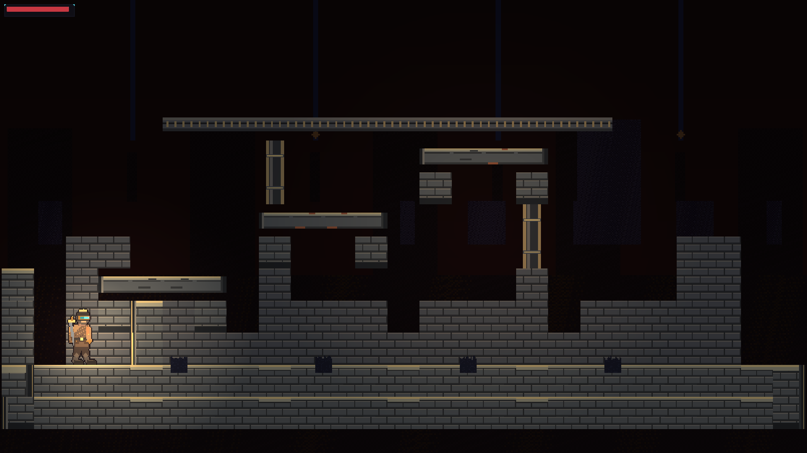

Spawn capture telemetry (windowed GPU): uniqueColors **114**, lumaStdDev **17.64**, occupancy **0.35**. Scored `qa/screenshot_gameplay.png` critic: **PASS score 100** (occupancy 0.35, luma 17.66, 110 colors). Heuristic score is **not** art approval.

Camera (preserved): tutorial playable band ~`zoom=2.39 view=804×452 center=400,374`.

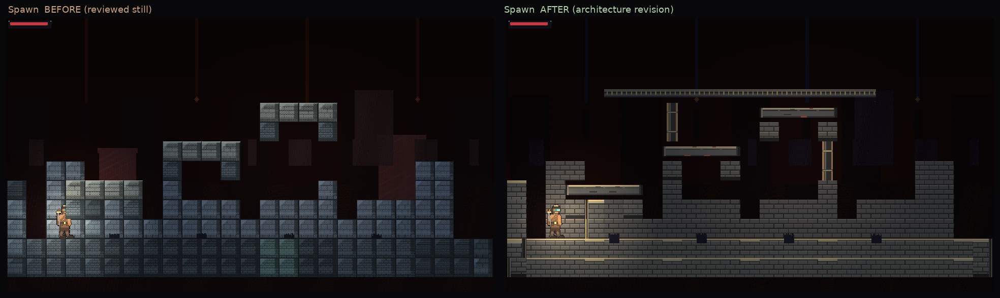

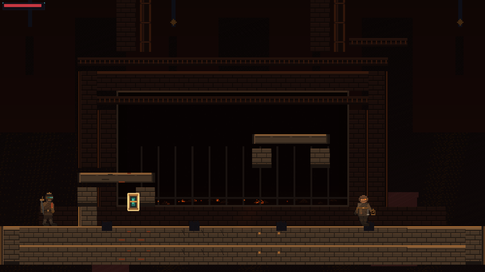

Shrine camera (preserved): `zoom=2.40 view=800×450 center=400,555`. Recessed furnace, coal bed, grate, rim, cream pickup outline, compact HUD.

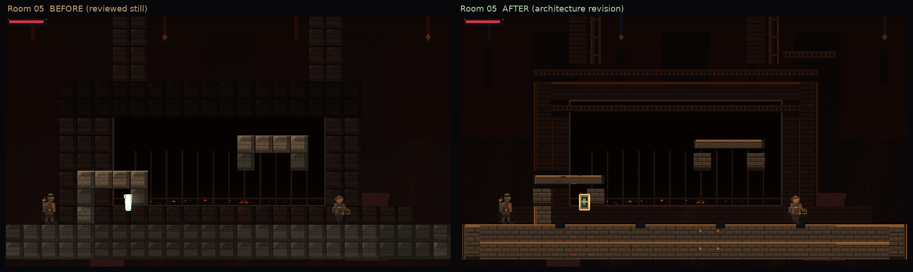

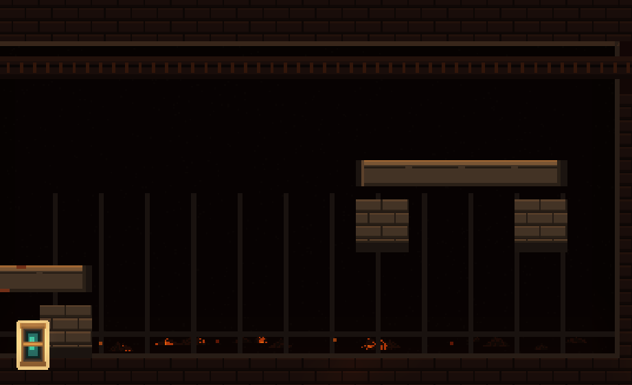

### Per-role rooms after the shared atlas (not copies of Room 05)

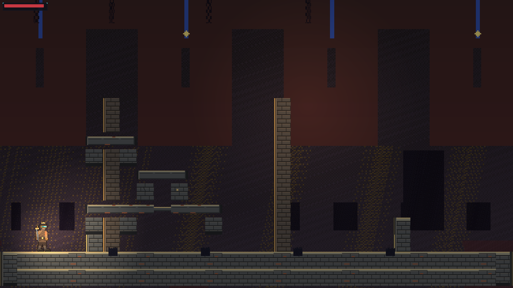

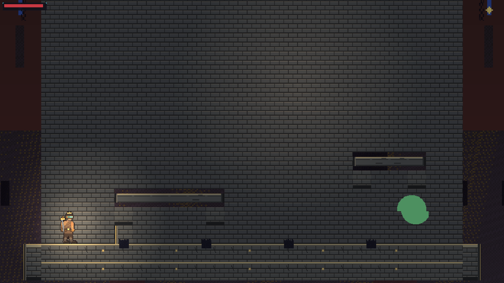

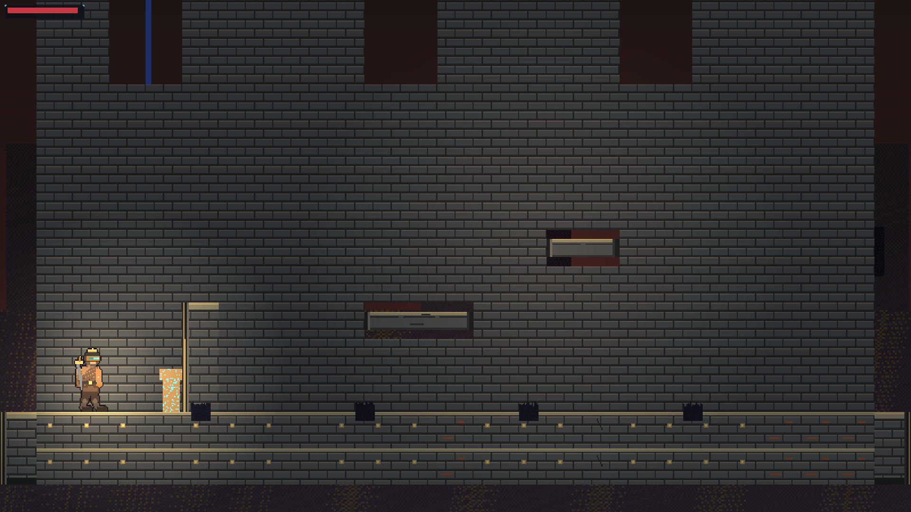

Room 04 / 07 are still solid gallery walls by role. Individually they fail the wallpaper heuristic (occupancy ≈1, lumaStdDev ~7). That is their authored silhouette, not a new flatten. Pairwise diversity on 11 slice stills: **11.28, pass** (was 13.81 on the previous identity recapture). Measured diversity is **not** visual approval.

---

## Actor close-ups — native 64px and labeled enlargements

Courier art is unchanged. In-scene crops are camera-zoomed capture pixels (~2.4×).

### Wanderer — native 64px + 8×

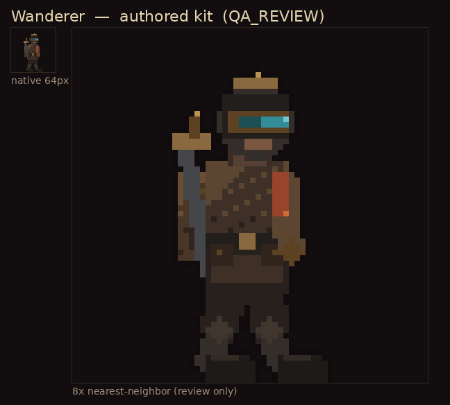

### Foundry tender — native 64px + 8×

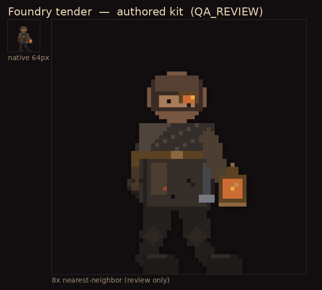

### In-scene (this revision)

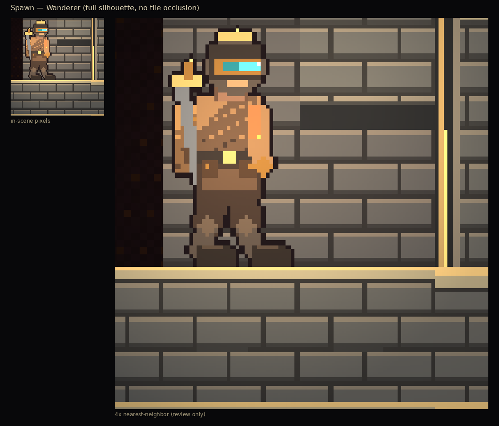

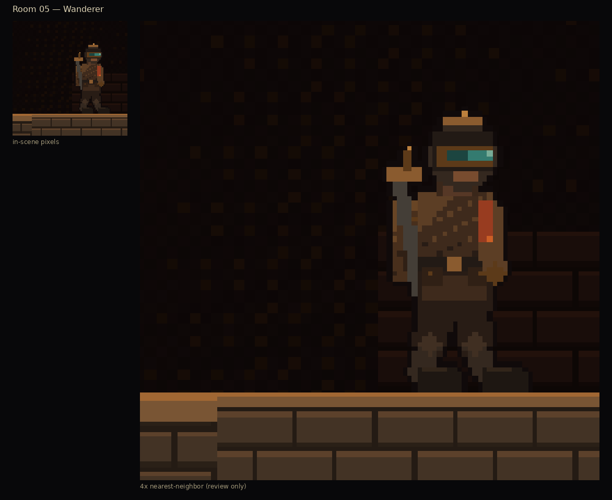

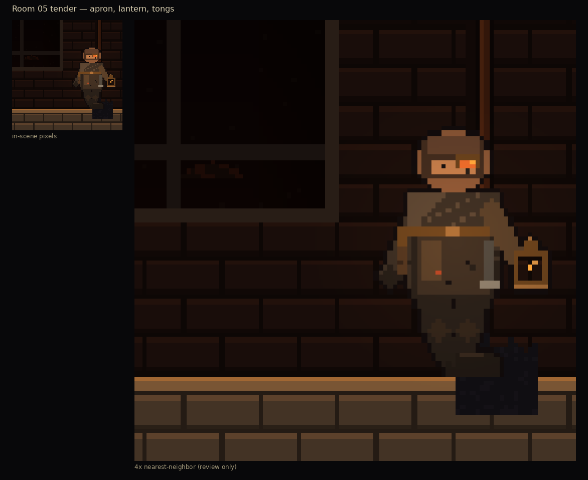

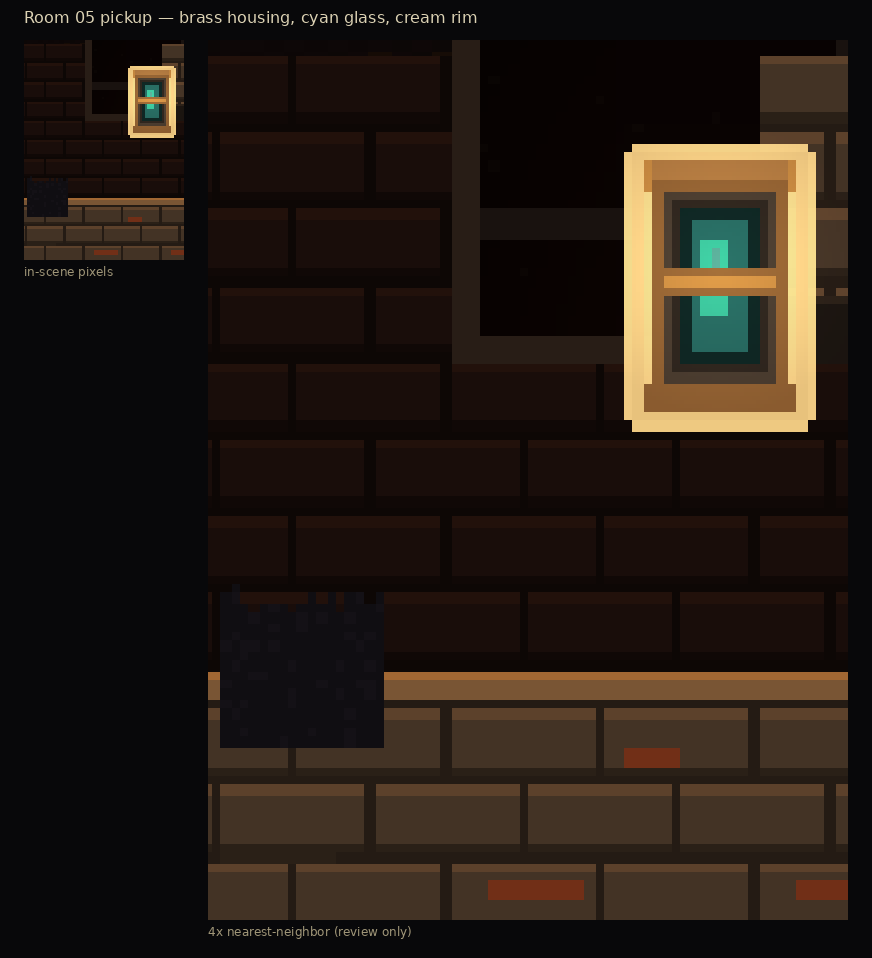

---

## Movement clip

[spawn_walk.webm](spawn_walk.webm) — ~2.5 s @ 10 fps, spawn-hall walk only (trimmed before the right-door transition). Wanderer stays in front of masonry; walk poses are distinct frames (not a bob). Camera stays the tutorial contain-frame. Use this to judge occlusion, foot timing, and sliding; it is not an animation-production pass. The jump press did not leave the ground in this short window.

---

## Visual acceptance checklist (linked evidence)

Policy: [../VISUAL_ACCEPTANCE.md](../VISUAL_ACCEPTANCE.md). Automated rows are technical gates, not the human decision.

| # | Criterion | Human / auto | Evidence on this revision | Status for *this* decision |
|---|---|---|---|---|
| 1 | Player vs NPC roles (visor/pack/blade vs apron/lantern) | **Human** | [wanderer_vs_tender_8x.png](wanderer_vs_tender_8x.png), Room 05 still | **Asking human** (art unchanged) |
| 2 | Walk/attack poses distinct | **Human** | [wanderer_walk_6x.png](wanderer_walk_6x.png), [spawn_walk.webm](spawn_walk.webm) | **Asking human** |
| 3 | Room 05 recessed furnace (cavity, coal, grate, rim) | Preserved + rebuilt surround | [room05_furnace_cavity.png](room05_furnace_cavity.png), [room05_before_after.png](room05_before_after.png) | Confirm look |
| 4 | Pickup cream outline + interior form | **Human** | [room05_pickup_native_and_4x.png](room05_pickup_native_and_4x.png) | Confirm look |
| 5 | Tutorial spawn framing + readable courier | **Human** | [spawn_current.png](spawn_current.png), [spawn_wanderer_scene_native_and_4x.png](spawn_wanderer_scene_native_and_4x.png) | Confirm look |
| 6 | Remaining PLACEHOLDER kit (enemies, boss, VFX, HUD chrome) | Inventory | See below. Masonry is now authored `QA_REVIEW`, not PLACEHOLDER. | Does not block this direction gate |
| A | `gameplay_screenshot_qa` spawn still | Auto | critic **PASS 100** on `screenshot_gameplay.png`; diversity **11.28 pass** | Technical pass — **not** approval |
| B | `godot_playtest` 8/8 | Auto | `victory_rusher`, 38072ms, rooms 000–009, `gameComplete: true`, `inputSimulationUsed` | Technical pass — **not** approval |
| C | Sprite contract 64×64 / 256×64 / feet-bottom | Auto | authored courier kit | Unchanged |
| D | Collision 24×48 `(0,-24)` / NPC 28×52 `(0,-26)` | Auto | not modified | Unchanged |
| E | Camera telemetry spawn/shrine | Auto | spawn 2.39/804×452/400,374; shrine 2.40/800×450/400,555 | Unchanged |
| F | Actor maturity `QA_REVIEW` | Policy | authored-kit provider | **Keep** |
| G | `placeholderRatio > 0.6` | Production scorer | Enemies/boss/VFX/HUD still PLACEHOLDER | **Not a skip** of this human review |

Playtest check names (`PlaytestRunner.gd`): `world_scene_loads`, `playtest_route_file_present`, `playtest_persona_configured`, `playtest_used_input_simulation`, `playtest_completed_transitions`, `playtest_reached_victory_flow`, `playtest_victory_state_or_boss_defeated`, `playtest_telemetry_emitted`. Fresh run on this revision: **8/8 PASS**. Telemetry: [playtest_telemetry.json](playtest_telemetry.json).

---

## Remaining PLACEHOLDER assets

| Category | Slice expectation | Maturity now | Blocks *Approve Visual Direction*? | Blocks production-ready / MASS polish? |
|---|---|---|---|---|
| Player (Wanderer) + poses | Authored kit | **QA_REVIEW** | No | Later `PRODUCTION_READY` is a different gate |
| NPC `npc_000` (tender) | Authored kit | **QA_REVIEW** | No | Same |
| Tiles / masonry | 1 biome tileset | **QA_REVIEW** (authored foundry atlas) | No — this revision’s `tilesetQuality` subject | Later production promotion |
| Ability-core pickup | Authored 32×32 | **QA_REVIEW** | No | Same |
| Enemies | 4 enemy ids + sheets | **PLACEHOLDER** | No | **Yes** |
| Boss | 1 (`boss_final`) | **PLACEHOLDER** | No | **Yes** |
| VFX | 9 textures | **PLACEHOLDER** | No | **Yes** |
| HUD chrome | `UI_FOUNDRY_ASSETS` | **PLACEHOLDER** | No | **Yes** |

---

## Provenance

| Field | Value |
|---|---|
| Courier kit | `packages/assets/authored/foundry-courier/` |
| Masonry + ability-core | `packages/assets/authored/foundry-masonry/` |
| Tool | Local `paint_foundry_courier.py` / `paint_foundry_masonry.py` + Pillow (rasterizer only) |
| Paid APIs / hosted models / third-party packs | none |
| License | Original-MetroForge — commercial OK (`LICENSE` in those directories) |
| Pipeline | `authored-original` when `profile === 'VISUAL_VERTICAL_SLICE'` and `tileSize === 32` |
| Docs | [../assets/PROVENANCE.md](../assets/PROVENANCE.md), kit `PROVENANCE.md` files |

---

## Preserved (do not churn)

Recessed furnace cavity/coal/grate/rim, shrine/spawn camera settings, tutorial playable-band framing, spawn key light, compact HUD, pickup collision, player/NPC collision, screenshot QA thresholds, `.metroforge/visual-slice-approval.json`.

---

## Decision requested

**Please approve or reject visual direction for this Foundry vertical slice after the architecture/occlusion revision.**

If **Approve Visual Direction**: an authorized human uses Generation Studio (not this agent). Then MASS art for LARGE / RELEASE_CANDIDATE may proceed. Actors and masonry remain `QA_REVIEW` until a later production promotion. Enemies, boss, VFX, and HUD chrome still need production passes. This PR stays draft until you say otherwise.

If **Reject / request revision**: say which rubric rows still fail. Do not treat spawn score 100, diversity 11.28, or playtest 8/8 as a substitute for that call.
