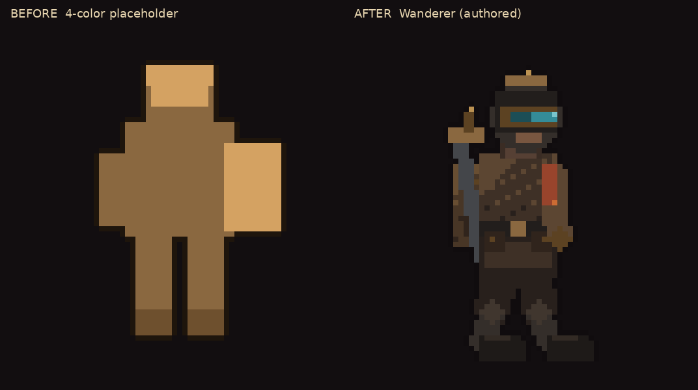
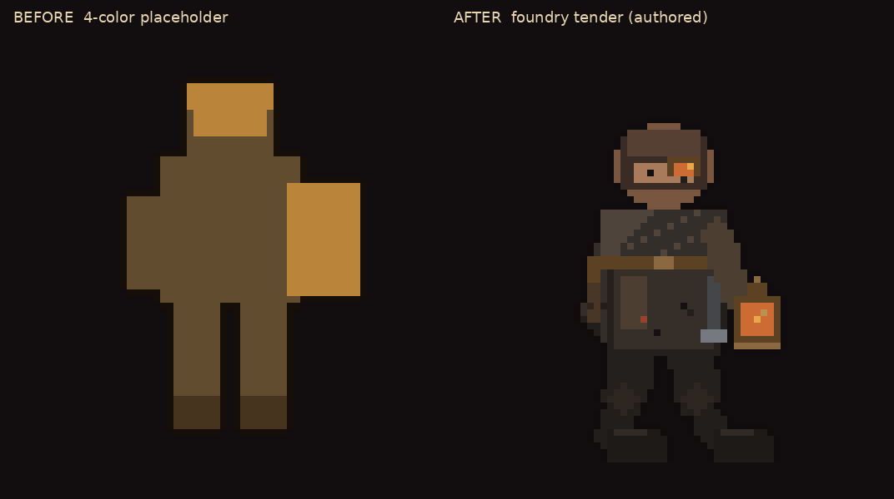
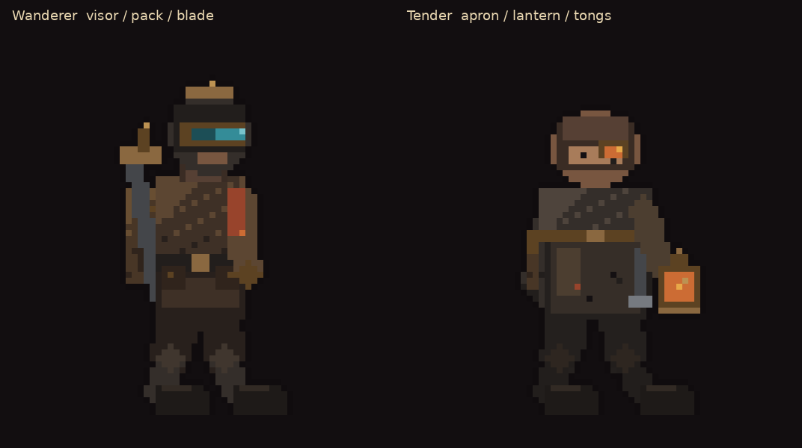
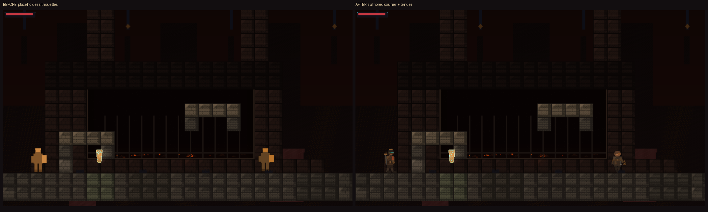
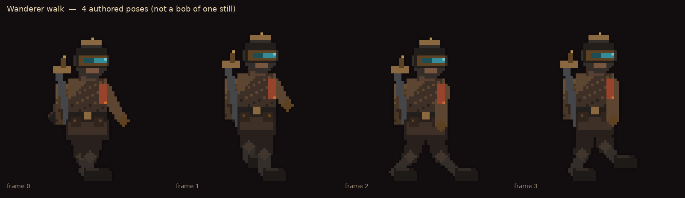
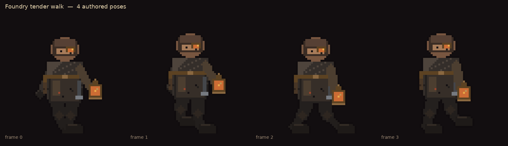
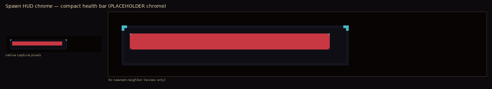

# Foundry visual slice — human “Approve Visual Direction” package

**This document is a review packet. It is not approval.**  
Automated screenshot QA, playtest, this packaging pass, and any agent instruction do **not** set `visualSliceApproved`. Only an authorized human clicking **Approve Visual Direction** in Generation Studio (or an equivalent write of `.metroforge/visual-slice-approval.json`) can.

Draft PR: https://github.com/alexandnevaeh-dev/MetroForgeSis/pull/4  
Keep **draft**. Do not merge. MASS / LARGE / RELEASE_CANDIDATE stay **blocked**. Actor maturity stays **QA_REVIEW**.

---

## What this approval covers (and what it does not)

Studio path: `VisualReviewScreen` → IPC `decide-visual-slice-review` → writes `.metroforge/visual-slice-approval.json`. Gate: `assertMassVisualGenerationAllowed` (`packages/shared/src/visual-slice.ts`). Mass profiles: **LARGE** and **RELEASE_CANDIDATE** only.

**Approve Visual Direction covers** the *direction* of this Foundry `VISUAL_VERTICAL_SLICE` as the template for later mass art:

1. Player vs NPC roles — Wanderer (visor, pack, blade) vs foundry tender (apron, lantern, tongs); same soot-iron/brass language, not a recolor of one silhouette.
2. Walk/attack poses as distinct frames, not a 1px bob of a still.
3. Palette / lighting language (soot, gunmetal, brass, spawn key light, shrine furnace).
4. Tutorial spawn framing and Room 05 shrine composition (recessed furnace preserved).

**It does not:**

- Mark any asset `PRODUCTION_READY` (authored courier stays `QA_REVIEW` even after this yes).
- Finish enemies, boss, tiles, VFX, or HUD chrome.
- Mean automated QA = aesthetic pass (`AUTOMATED_VISUAL_PASS_HUMAN_REVIEW_REQUIRED`).
- Close production visual scoring (`placeholderRatio > 0.6` still hard-fails `scoreVisualQuality`).
- Change collision, camera math, pickup outline, HUD layout, or QA thresholds.

Human rubric (score in Studio, 1–5): `artCoherence`, `playerReadability`, `environmentCoherence`, `tilesetQuality`, `animationQuality`, `lightingDepth`, `combatReadability`, `vfxIntegration`, `roomComposition`, `hud`, `bossPresentation`, `overallPolish`.

---

## Revision under review

| Field | Value |
|---|---|
| Package branch HEAD (pre-this-commit) | `eb12ea9` `docs(review): camera-visibility during-play audit + spawn-frame refinement evidence` |
| Spawn-frame code commit | `89824e7` `fix(godot): tighten courier focal + lift mid-ground fill in spawn frame` |
| Authored courier kit | `232922d` `feat(assets): ship original foundry courier actor art` |
| Generation slug | `foundry-visual-slice-spawn2` |
| Profile / mode / seed | `VISUAL_VERTICAL_SLICE` / `LOCAL_ONLY` / `20260909` |
| Viewport / Godot | 1920×1080 windowed `opengl3` / `4.7.1.stable.official.a13da4feb` |
| `visualSliceApproved` | **false** (`VISUAL_SLICE_REJECTED`) |
| Actor maturity | **QA_REVIEW** (`authored-original`, `sourceType: manual`, `fallbackGenerated: false`) |

### Stills attached to this revision (byte-identical)

| Still | Path | sha256 prefix |
|---|---|---|
| Spawn (scored `qa/screenshot_gameplay.png`) | [spawn_current.png](spawn_current.png) = `review-artifacts/critic/screenshot_gameplay.png` | `9f1452c70da65891` |
| Room 05 shrine | [room05_current.png](room05_current.png) = `review-artifacts/after/05_ability.png` | `2478d44ff449965a` |
| Authored Wanderer 64px | `packages/assets/authored/foundry-courier/player.png` | `e1e78ce797ebc4c3` |
| Authored tender 64px | `packages/assets/authored/foundry-courier/npc_000.png` | `5d52ace55b88437a` |

Authored `player.png` is **pixel-identical** to `review-artifacts/player/player_after_64px.png` (24 opaque colors, 0 pixel diffs; PNG encoding differs: `e1e78ce7…` vs `8677d1ed…`).

### Agent boundary

A Claude agent in VS Code owns spawn lighting (`QualityPresentation.gd`), the camera-visibility audit (`tools/camera_visibility_audit.gd`, `review-artifacts/camera-visibility/`), and the current spawn still. **This package only adds `review-artifacts/human-review/`** (plus a pointer in `review-artifacts/README.md`). No gameplay, camera, collision, furnace, HUD, pickup, or QA-threshold files were edited here.

---

## Current spawn and Room 05

Spawn critic (`review-artifacts/critic/screenshot_critique.json`): **PASS score 100**, occupancy **0.400**, lumaStdDev **15.48**, **106** colors, issues `[]`. Same bytes as the still above.

Camera (preserved): tutorial playable band ~`zoom=2.39 view=804×452 center=400,374` (target `2.40 / 800×450 / 400,375`). Spawn key light and receded far plate are in this still.

Shrine camera (preserved): `zoom=2.40 view=800×450 center=400,555`. Recessed furnace, coal bed, grate, rim, cream pickup outline, compact HUD.

---

## Actor close-ups — native 64px and labeled enlargements

Native scale is the **authored 64×64 sprite**. In-scene crops are camera-zoomed capture pixels (~2.4×), not the art canvas. 4×/6×/8× boards are **review enlargements only**.

### Wanderer — native 64px + 8×

### Foundry tender — native 64px + 8×

### In-scene (as captured) + 4× labeled

---

## Before / after — Wanderer and foundry tender

Spawn composition: BEFORE score **40** (occupancy 1.0, luma 7.4) → AFTER score **100** (occupancy 0.40, luma 15.5). Heuristic score is not art approval.

### Walk poses (not a bob of one still)

---

## Visual acceptance checklist (linked evidence)

Policy: [../VISUAL_ACCEPTANCE.md](../VISUAL_ACCEPTANCE.md). Automated rows are technical gates, not the human decision.

| # | Criterion | Human / auto | Evidence on this revision | Status for *this* decision |
|---|---|---|---|---|
| 1 | Player vs NPC roles (visor/pack/blade vs apron/lantern) | **Human** | [wanderer_vs_tender_8x.png](wanderer_vs_tender_8x.png), Room 05 still | **Asking human** |
| 2 | Walk/attack poses distinct | **Human** | [wanderer_walk_6x.png](wanderer_walk_6x.png), [tender_walk_6x.png](tender_walk_6x.png) | **Asking human** |
| 3 | Room 05 recessed furnace (cavity, coal, grate, rim) | Preserved; human confirms | [room05_furnace_cavity.png](room05_furnace_cavity.png) | Preserved; confirm look |
| 4 | Pickup cream outline readable on soot | Preserved; human confirms | [room05_pickup_native_and_4x.png](room05_pickup_native_and_4x.png) | Preserved; confirm look |
| 5 | Tutorial spawn framing + spawn key light | Preserved; human confirms | [spawn_current.png](spawn_current.png), [spawn_frame_before_after.png](spawn_frame_before_after.png) | Preserved; confirm look |
| 6 | Remaining PLACEHOLDER kit (enemies, boss, tiles, VFX, HUD chrome) | Inventory | See below | **Does not block this direction gate**; **does** block calling the slice production-ready |
| A | `gameplay_screenshot_qa` spawn still | Auto | critic **PASS 100** on `screenshot_gameplay.png` (`9f1452c70da65891`) | Technical pass — **not** approval |
| B | `godot_playtest` 8/8 | Auto | telemetry: persona `victory_rusher`, 38034ms, rooms 000–009, `gameComplete: true`, `inputSimulationUsed` | Technical pass — **not** approval |
| C | Sprite contract 64×64 / 256×64 / feet-bottom | Auto | authored kit + pipeline test | Unchanged |
| D | Collision 24×48 `(0,-24)` / NPC 28×52 `(0,-26)` | Auto | not modified this pass | Unchanged |
| E | Camera telemetry spawn/shrine | Auto | spawn ~2.39/804×452/400,374; shrine 2.40/800×450/400,555 | Unchanged |
| F | Actor maturity `QA_REVIEW` | Policy | authored-kit provider | **Keep until human + later production promotion** |
| G | `placeholderRatio > 0.6` | Production scorer | Expected until MASS art | **Not a skip** of this human review |

Playtest check names (`PlaytestRunner.gd`): `world_scene_loads`, `playtest_route_file_present`, `playtest_persona_configured`, `playtest_used_input_simulation`, `playtest_completed_transitions`, `playtest_reached_victory_flow`, `playtest_victory_state_or_boss_defeated`, `playtest_telemetry_emitted`. On-disk file is telemetry, not a fresh stdout log of the eight PASS lines; the recorded outcome matches 8/8.

**Honesty on recapture timing:** playtest telemetry was recorded on the authored-courier spawn2 project **before** `89824e7` (focal/fill tighten). That commit is lighting-only; collision and route are unchanged. Spawn still + critic JSON **are** from `89824e7`/`eb12ea9`. Checks were **not** re-run for this packaging pass (evidence for the spawn still is current; playtest is equivalent, not HEAD-attached).

A separate VS Code agent recorded that **cross-room screenshot diversity** still fails the combined `gameplay_screenshot_qa` gate (rooms share a gunmetal-grid signature). That is a **tiles / MASS** issue. It does not replace this direction review, and a diversity fail is **not** visual approval either.

---

## Remaining PLACEHOLDER assets

`VISUAL_VERTICAL_SLICE` still generates procedural (PLACEHOLDER) art for everything except the authored courier actors.

| Category | Slice expectation | Maturity now | Blocks *Approve Visual Direction*? | Blocks production-ready / MASS polish? |
|---|---|---|---|---|
| Player (Wanderer) + poses | Authored kit | **QA_REVIEW** | No — this is the subject of the review | Later promotion to `PRODUCTION_READY` is a different gate |
| NPC `npc_000` (tender) | Authored kit | **QA_REVIEW** | No | Same |
| Enemies | 4 enemy ids (`PROFILE_DEFAULTS`) + sheets | **PLACEHOLDER** | **No** — MASS-gated later work | **Yes** for finished slice |
| Boss | 1 (`boss_final`) + sheets | **PLACEHOLDER** | No | **Yes** (`bossPresentation`) |
| Tiles / masonry | 1 biome tileset (floor, walls, platforms, one-way, …) | **PLACEHOLDER** | No (reviewers still score `tilesetQuality`) | **Yes**; also the diversity fail |
| VFX | 9 textures: `hit_spark`, `death_puff`, `dash_trail`, `pickup_spark`, `ability_unlock`, `boss_phase_shift`, `area_burst`, `slam_shock`, `landing_dust` | **PLACEHOLDER** | No | **Yes** (`vfxIntegration`) |
| HUD chrome | `UI_FOUNDRY_ASSETS` (`hud_frame`, `health_meter`, `boss_bar`, panels, icons, …) | **PLACEHOLDER** / generated panels; capture uses a compact StyleBoxFlat health bar | No | **Yes** (`hud`) |

Policy (`VISUAL_ACCEPTANCE.md` item 6): remaining PLACEHOLDER kit is **MASS-gated** and still a blocker for calling the slice **production-ready**. It is **not** a reason to skip this direction review. After a human yes, `assertMassVisualGenerationAllowed` lets LARGE / RC mass-generate that kit; until then those profiles stay blocked.

---

## Provenance

| Field | Value |
|---|---|
| Kit | `packages/assets/authored/foundry-courier/` |
| Tool | Local `paint_foundry_courier.py` + Pillow 12 (rasterizer only) |
| Paid APIs / hosted models / third-party packs | none |
| License | Original-MetroForge — commercial OK (`LICENSE` in that directory) |
| Pipeline | `authored-original` when `profile === 'VISUAL_VERTICAL_SLICE'` (or foundry/courier/wanderer copy). `TINY_TEST` stays procedural. |
| Docs | [../assets/PROVENANCE.md](../assets/PROVENANCE.md), kit `PROVENANCE.md` |

---

## Preserved (do not churn before this decision)

Recessed furnace, shrine/spawn camera settings, tutorial playable-band framing, spawn key light, compact HUD, pickup cream outline, collision shapes, screenshot QA thresholds.

---

## Decision requested

**Please approve or reject visual direction for this Foundry vertical slice.**

If **Approve Visual Direction**: an authorized human uses Generation Studio (not this agent). Then MASS art for LARGE / RELEASE_CANDIDATE may proceed. Actors remain `QA_REVIEW` until a later production promotion. Enemies, boss, tiles, VFX, and HUD chrome still need production passes. This PR stays draft until you say otherwise.

If **Reject / request revision**: say which rubric rows fail (identity, lighting, framing, poses, etc.). Do not treat spawn score 100 or playtest 8/8 as a substitute for that call.
